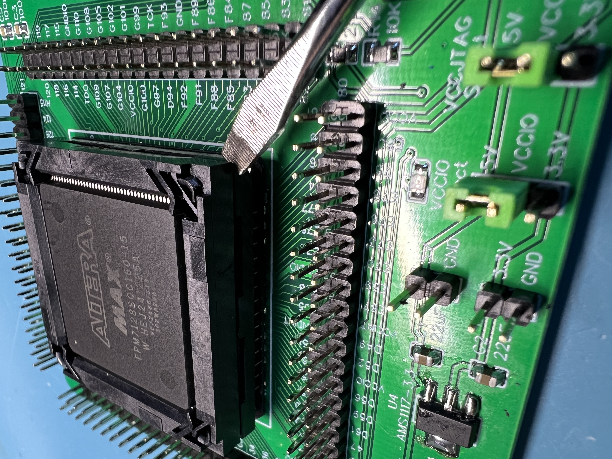

This is a breakout board for the Altera MAX7000 EPM7128SQC160 which
allows for quick connection and attachment of these parts for
programming and verification. It might also work with the
Atmel ATF1508 QC160.

The board is known by the nickname Avocado or Holy Guacamole.
:evergreen_tree: So, :cactus: if :four_leaf_clover: you :green_apple: make :pear: your :dragon: own, :white_check_mark: make it :heavy_dollar_sign: GREEN :green_heart:.



-------------------------------------------------------------

Configuration:
    1. Set VCCIO jumper to 5V
    2. Set VCCJTAG jumper to 5V
    3. Connect a USB-C power supply to the USB-C header or
       connect a bench power supply to the 5V and GND header.
    4. Connect your JTAG programmer to the board.

-------------------------------------------------------------

Programming the EPM7128

Install Quartus 22.2 under Windows (version for Linux might not work).
If the Quartus driver does not like your USB Blaster clone, you might need
to use the driver from Quartus 13.1

When installing the drivers, don't dive too deep into the tree.
Stop at for instanc:
    C:\altera\13.1\quartus\drivers
OR
    C:\intelFPGA_lite\22.1std\quartus\drivers

And let Windows pick them up from there


In Quartus, select Program/Configure and Verify checkboxes.

-------------------------------------------------------------

There are two JTAG headers on the programmer.
Use either for programming, depending on your adapter.
```
          --------
   TCK  1 | O  O | 2   GND
   TDO  3 | O  O | 4   VCC
   TMS  5 | O  O | 6   nc
   nc   7 | O  O | 8   nc
   TDI  9 | O  O | 10  GND
          --------
```

```
           -
   TMS  1 |O|
   TDI  2 |O|
   TDO  3 |O|
   TCK  4 |O|
   GND  5 |O|
   VCC  6 |O|
           -
```
